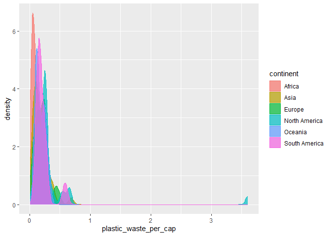
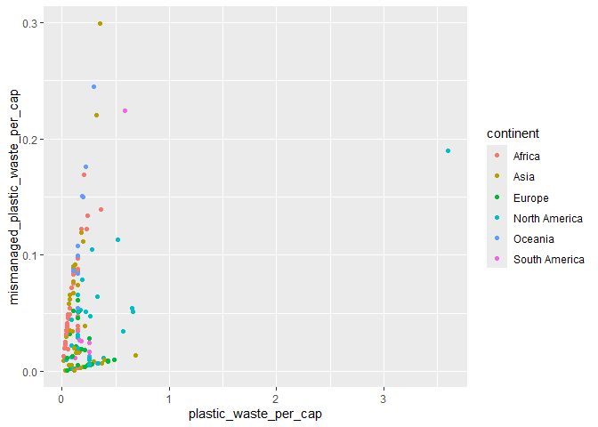
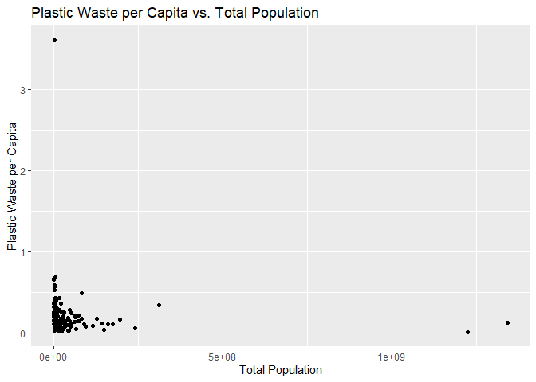
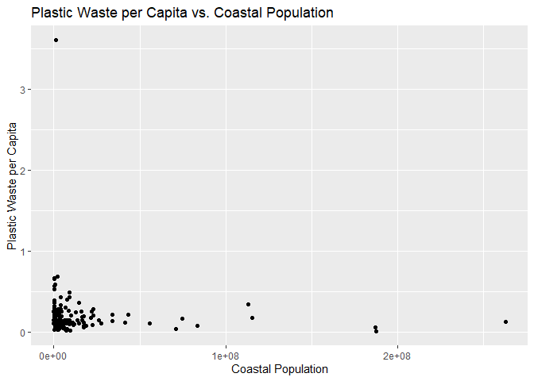
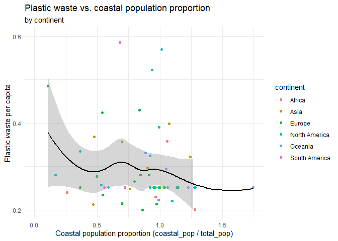

Lab 02 - Plastic waste
================
Jamieson Nathan
2/9/25

## Load packages and data

``` r
library(tidyverse) 
```

``` r
plastic_waste <- read.csv("data/plastic-waste.csv")
```

## Exercises

### Exercise 1

Overall, Europe and North America tend to have higher per capita plastic
waste generation, with greater variability and more significant
outliers. In contrast, Africa, Asia, and South America generally show
lower per capita generation with less variability. Oceania appears
unique with its split distribution, possibly reflecting the diverse
economic status and consumption patterns within the continent.

``` r
ggplot(
  data = plastic_waste,
  mapping = aes(
    x = plastic_waste_per_cap,
    color = continent,
    fill = continent
  )
) +
  geom_density(alpha = 0.7)
```

    ## Warning: Removed 51 rows containing non-finite outside the scale range
    ## (`stat_density()`).

<!-- -->

### Exercise 2

``` r
# insert code here
ggplot(
  data = plastic_waste,
  mapping = aes(
    x = plastic_waste_per_cap,
    color = continent,
    fill = continent
  )
) +
  geom_density(alpha = 0.3)
```

    ## Warning: Removed 51 rows containing non-finite outside the scale range
    ## (`stat_density()`).

<!-- --> We
specify color and fill inside aes() because we want those attributes to
vary according to the continent variable in your dataset and it tells
ggplot2 to create a separate color/fill for each continent. However, we
specify alpha outside aes() because we want the same transparency level
for all density curves. Since it does not vary by a data variable, we
treat it as a fixed characteristic of the geometry, instead of a mapped
aesthetic.

### Exercise 3

Remove this text, and add your answer for Exercise 3 here.

``` r
# insert code here

ggplot(
  data = plastic_waste,
  mapping = aes(
    x = continent,
    y = plastic_waste_per_cap
  )
) +
  geom_violin()
```

    ## Warning: Removed 51 rows containing non-finite outside the scale range
    ## (`stat_ydensity()`).

<!-- -->

Violin plots show the density of the data across different values,
making it easier to spot multiple peaks or skewed distributions. The
width at different points along the violin indicates how many data
points fall in that region. Box plots, however, make it very clear what
the quartile valeus are and highlights the presence of outliers.

### Exercise 4

Remove this text, and add your answer for Exercise 4 here.

``` r
# insert code here

ggplot(
  data = plastic_waste,
  aes(
    x = plastic_waste_per_cap,
    y = mismanaged_plastic_waste_per_cap
  )
) +
  geom_point()
```

    ## Warning: Removed 51 rows containing missing values or values outside the scale range
    ## (`geom_point()`).

<!-- -->

``` r
# insert code here

ggplot(
  data = plastic_waste,
  aes(
    x = plastic_waste_per_cap,
    y = mismanaged_plastic_waste_per_cap,
    color = continent
  )
) +
  geom_point()
```

    ## Warning: Removed 51 rows containing missing values or values outside the scale range
    ## (`geom_point()`).

<!-- -->

``` r
# insert code here

ggplot(plastic_waste, aes(x = total_pop, y = plastic_waste_per_cap)) +
  geom_point() +
  labs(
    title = "Plastic Waste per Capita vs. Total Population",
    x = "Total Population",
    y = "Plastic Waste per Capita"
  )
```

    ## Warning: Removed 61 rows containing missing values or values outside the scale range
    ## (`geom_point()`).

<!-- -->

``` r
# insert code here

ggplot(plastic_waste, aes(x = coastal_pop, y = plastic_waste_per_cap)) +
  geom_point() +
  labs(
    title = "Plastic Waste per Capita vs. Coastal Population",
    x = "Coastal Population",
    y = "Plastic Waste per Capita"
  )
```

    ## Warning: Removed 51 rows containing missing values or values outside the scale range
    ## (`geom_point()`).

<!-- -->

Neither relationships seem to suggest strong linear associations.

### Exercise 5

Remove this text, and add your answer for Exercise 5 here.

``` r
# insert code here

plastic_waste %>%
  mutate(coastal_pop_prop = coastal_pop / total_pop) %>%
  filter(plastic_waste_per_cap < 3) %>%
  ggplot(aes(
    x = coastal_pop_prop,
    y = plastic_waste_per_cap,
    color = continent
  )) +
  geom_point() +
  geom_smooth(color = "black") +
  scale_color_viridis_d() +
  labs(
    x = "Coastal population proportion (Coastal / total population)",
    y = "Plastic waste per capita ",
    color = "Continent",
    title = "Plastic waste vs. coastal population proportion",
    subtitle = "by continent"
  ) +
  theme_minimal()
```

    ## `geom_smooth()` using method = 'loess' and formula = 'y ~ x'

    ## Warning: Removed 10 rows containing non-finite outside the scale range
    ## (`stat_smooth()`).

    ## Warning: Removed 10 rows containing missing values or values outside the scale range
    ## (`geom_point()`).

<!-- -->

Done!
