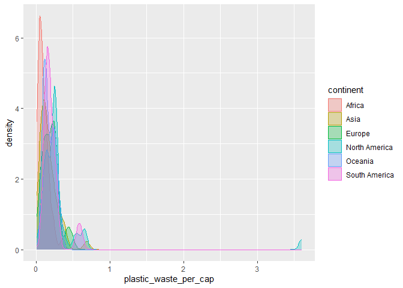
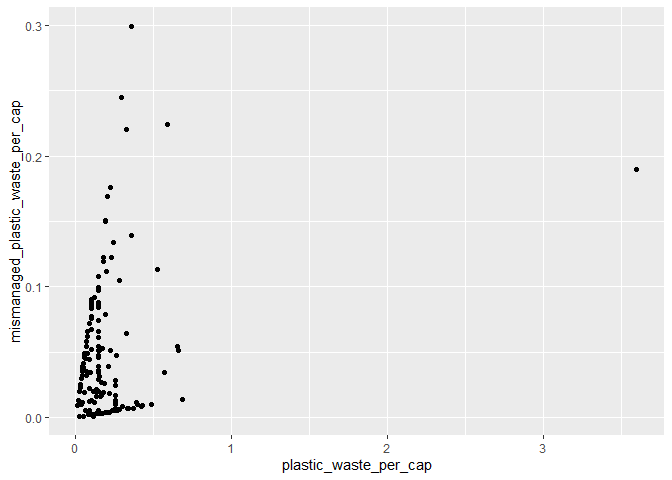
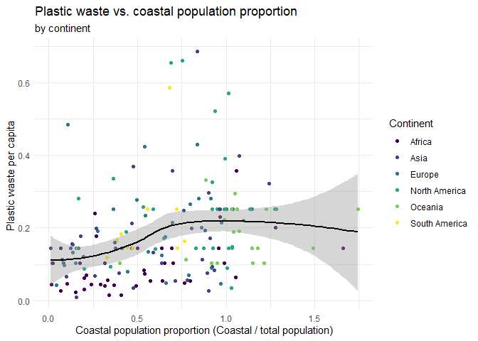

Lab 02 - Plastic waste
================
Insert your name here
Insert date here

## Load packages and data

``` r
library(tidyverse) 
```

``` r
plastic_waste <- read.csv("data/plastic-waste.csv")
```

## Exercises

### Exercise 1

Remove this text, and add your answer for Exercise 1 here.

``` r
# insert code here
ggplot(
  data = plastic_waste,
  mapping = aes(
    x = plastic_waste_per_cap,
    color = continent,
    fill = continent
  )
) +
  geom_density(alpha = 0.7)
```

    ## Warning: Removed 51 rows containing non-finite outside the scale range
    ## (`stat_density()`).

<!-- -->

### Exercise 2

``` r
# insert code here
ggplot(
  data = plastic_waste,
  mapping = aes(
    x = plastic_waste_per_cap,
    color = continent,
    fill = continent
  )
) +
  geom_density(alpha = 0.3)
```

    ## Warning: Removed 51 rows containing non-finite outside the scale range
    ## (`stat_density()`).

<!-- --> We
specify color and fill inside aes() because we want those attributes to
vary according to the continent variable in your dataset and it tells
ggplot2 to create a separate color/fill for each continent. However, we
specify alpha outside aes() because we want the same transparency level
for all density curves. Since it does not vary by a data variable, we
treat it as a fixed characteristic of the geometry, instead of a mapped
aesthetic.

### Exercise 3

Remove this text, and add your answer for Exercise 3 here.

``` r
# insert code here

ggplot(
  data = plastic_waste,
  mapping = aes(
    x = continent,
    y = plastic_waste_per_cap
  )
) +
  geom_violin()
```

    ## Warning: Removed 51 rows containing non-finite outside the scale range
    ## (`stat_ydensity()`).

<!-- -->

Violin plots show the density of the data across different values,
making it easier to spot multiple peaks or skewed distributions. The
width at different points along the violin indicates how many data
points fall in that region. Box plots, however, make it very clear what
the quartile valeus are and highlights the presence of outliers.

### Exercise 4

Remove this text, and add your answer for Exercise 4 here.

``` r
# insert code here

ggplot(
  data = plastic_waste,
  aes(
    x = plastic_waste_per_cap,
    y = mismanaged_plastic_waste_per_cap
  )
) +
  geom_point()
```

    ## Warning: Removed 51 rows containing missing values or values outside the scale range
    ## (`geom_point()`).

<!-- -->

``` r
# insert code here

ggplot(
  data = plastic_waste,
  aes(
    x = plastic_waste_per_cap,
    y = mismanaged_plastic_waste_per_cap,
    color = continent
  )
) +
  geom_point()
```

    ## Warning: Removed 51 rows containing missing values or values outside the scale range
    ## (`geom_point()`).

<!-- -->

``` r
# insert code here

ggplot(plastic_waste, aes(x = total_pop, y = plastic_waste_per_cap)) +
  geom_point() +
  labs(
    title = "Plastic Waste per Capita vs. Total Population",
    x = "Total Population",
    y = "Plastic Waste per Capita"
  )
```

    ## Warning: Removed 61 rows containing missing values or values outside the scale range
    ## (`geom_point()`).

<!-- -->

``` r
# insert code here

ggplot(plastic_waste, aes(x = coastal_pop, y = plastic_waste_per_cap)) +
  geom_point() +
  labs(
    title = "Plastic Waste per Capita vs. Coastal Population",
    x = "Coastal Population",
    y = "Plastic Waste per Capita"
  )
```

    ## Warning: Removed 51 rows containing missing values or values outside the scale range
    ## (`geom_point()`).

<!-- -->

Neither relationships seem to suggest strong linear associations.

### Exercise 5

Remove this text, and add your answer for Exercise 5 here.

``` r
# insert code here

ggplot(plastic_waste, 
       aes(x = coastal_pop / total_pop,
           y = plastic_waste_per_cap,
           color = continent)) +
  geom_point() +
  geom_smooth(aes(group = 1), 
              method = "loess", 
              color = "black", 
              se = TRUE) +
  labs(
    title = "Plastic waste vs. coastal population proportion",
    subtitle = "by continent",
    x = "Coastal population proportion (coastal_pop / total_pop)",
    y = "Plastic waste per capita"
  ) +
  scale_y_continuous(
    limits = c(0.2, 0.6),
    breaks = seq(0.2, 0.6, 0.2)
  ) +
  theme_minimal()
```

    ## `geom_smooth()` using formula = 'y ~ x'

    ## Warning: Removed 181 rows containing non-finite outside the scale range
    ## (`stat_smooth()`).

    ## Warning: Removed 181 rows containing missing values or values outside the scale range
    ## (`geom_point()`).

<!-- -->

This is the closest I could get it…
